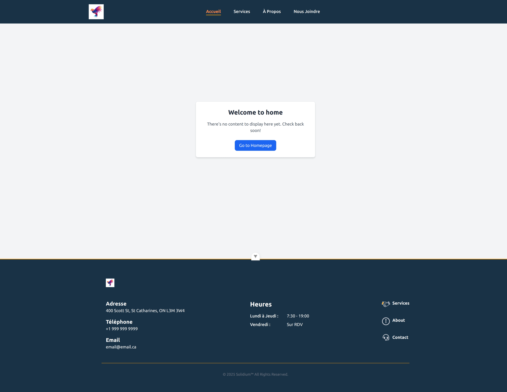

# Web App Template

This template should help get you started developing with Vue 3 in Vite.
The template utilizes Flowbite-Vue, a Vue 3 framework built on top of Flowbite and powered by Tailwind CSS. Both Flowbite and Tailwind CSS are also included in the project.

## Recommended IDE Setup

[VSCode](https://code.visualstudio.com/) + [Volar](https://marketplace.visualstudio.com/items?itemName=Vue.volar) (and disable Vetur).

## Type Support for `.vue` Imports in TS

TypeScript cannot handle type information for `.vue` imports by default, so we replace the `tsc` CLI with `vue-tsc` for type checking. In editors, we
need [Volar](https://marketplace.visualstudio.com/items?itemName=Vue.volar) to make the TypeScript language service aware of `.vue` types.

## Customize configuration

See [Vite Configuration Reference](https://vite.dev/config/).

## Project Setup

```sh
npm install
```

### Compile and Hot-Reload tailwindcss

```sh
npx tailwindcss -i ./src/assets/style/input.css -o ./src/assets/style/output.css --watch
```

### Compile and Hot-Reload for Development

```sh
npm run dev
```

### Type-Check, Compile and Minify for Production

```sh
npm run build
```

### Lint with [ESLint](https://eslint.org/)

```sh
npm run lint
```

## Quick Peak At The Super Basic UI

